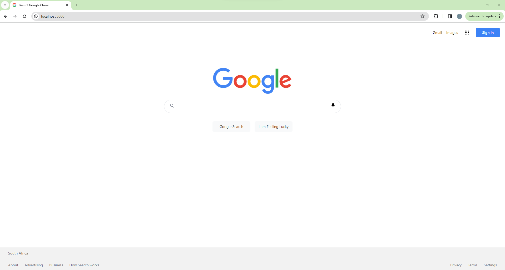

# Google Clone Made with Next.js 13
### [Live Site](https://liamt-google-clone.vercel.app)

## Breakdown
### This is a Google Clone made with Next.js13 and TailwindCSS

### Key Features
- You are able to Search terms and images.
- Utilizes the Programmable Search Engine API & Extreme-ip-lookup API. 
- Design is Responsive.
- Feel free to search anything or anyone!

